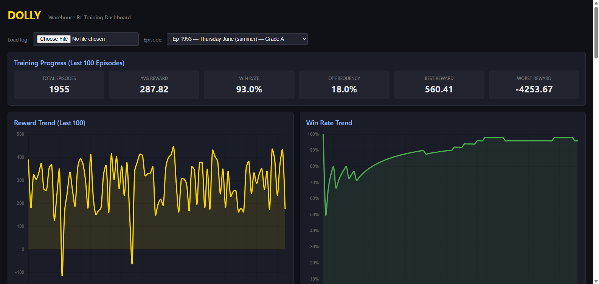
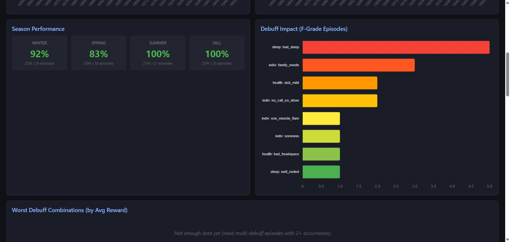
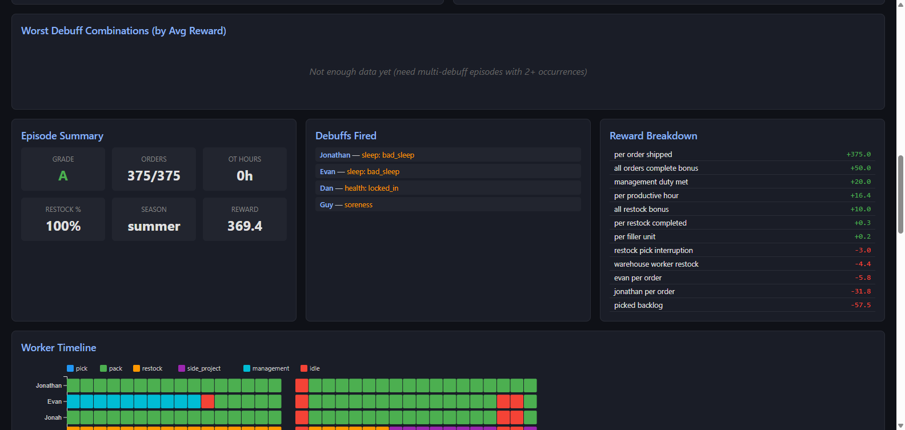
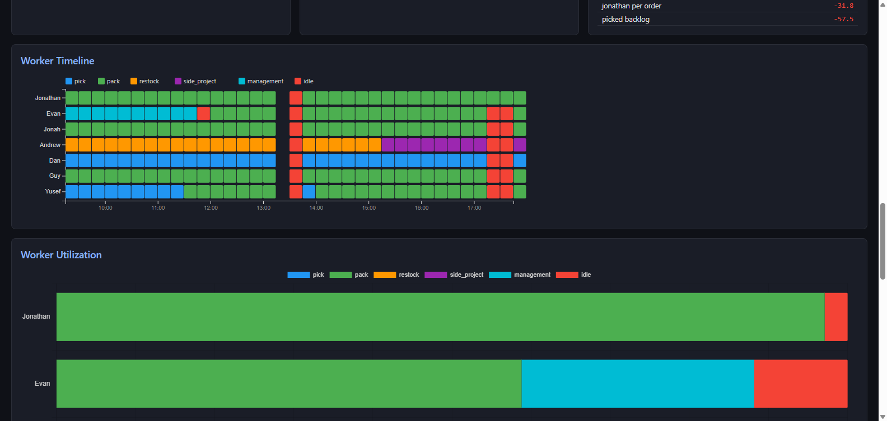
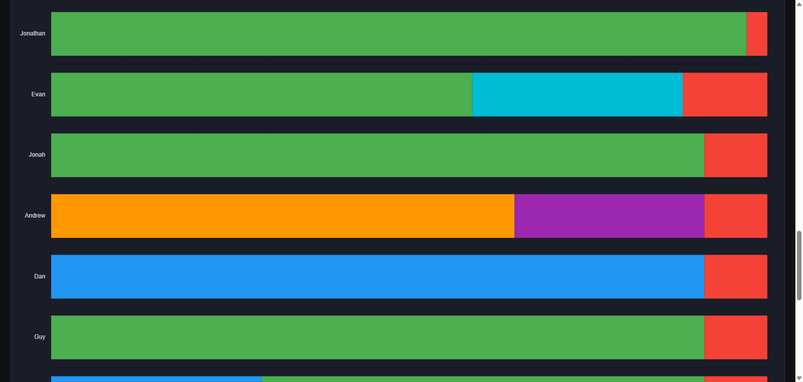
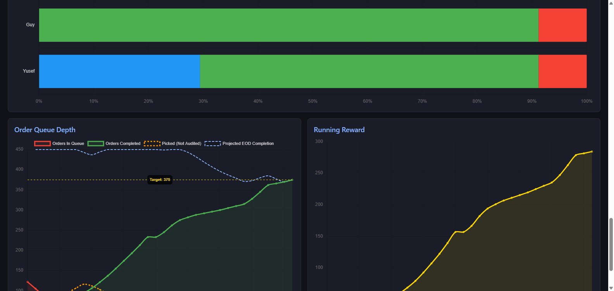

# DOLLY

**Reinforcement learning simulation for warehouse workforce optimization.**

A PPO agent learns to manage worker assignments, order flow, and shift logistics across seasonal demand cycles. Built from scratch — standalone environment, agent, logger, and live training dashboard.



---

## What It Does

Dolly simulates a 7-person warehouse operation across a full work day in 15-minute intervals. The RL agent makes staffing decisions — who picks, who packs, who restocks, who handles side projects — and learns to optimize for order completion, restock management, and minimal overtime.

The simulation models real warehouse dynamics:
- **Seasonal demand cycles** — order volume ranges from 60 (winter) to 500 (peak spring/summer)
- **Order arrival curves** — orders trickle in throughout the day, not all at once
- **Worker-specific debuffs** — bad sleep, illness, injuries, family needs, no-call-no-shows
- **Role constraints** — designated daily picker, manager duties, pack-only restrictions
- **Fatigue mechanics** — OPH degrades after sustained pick/pack thresholds
- **Hustle mode** — team pushes harder on high-volume days

## Dashboard

Single self-contained HTML file. Opens in any browser after a training run — no server required for file picker mode, or serve locally for auto-refresh.

### Training Progress & Trends


Real-time training metrics: total episodes, average reward, win rate, OT frequency, best/worst reward. Reward trend and win rate trend charts show learning progression across the last 100 episodes.

### Season Performance & Debuff Impact


Win rate broken down by season (winter/spring/summer/fall). Debuff impact tracker shows which debuffs most frequently appear in F-grade episodes — useful for understanding what conditions the agent struggles with.

### Episode Summary & Reward Breakdown


Per-episode deep dive: grade, orders shipped, OT hours, restock completion, season, total reward. Full reward signal breakdown showing every positive and negative contribution. Active debuffs listed for the selected episode.

### Worker Timeline


Horizontal bar per worker showing task assignments across the simulated day. Color-coded: blue (pick), green (pack), orange (restock), purple (side project), cyan (management), red (idle). The lunch break gap at 13:00 is visible. Shows exactly what the agent decided at each 30-minute interval.

### Worker Utilization


Stacked horizontal bars showing percentage of each worker's shift spent on each task. Idle time shown in red for immediate visibility. Reveals patterns like the designated picker spending 90%+ on pick, or the manager splitting between pack and management.

### Order Queue Depth & Running Reward


**Order Queue Depth** — tracks orders in queue (red), orders completed (green), picked-not-audited buffer (orange dashed), and projected EOD completion (blue dashed) against the target line. Shows exactly when the agent fell behind or surged ahead.

**Running Reward** — cumulative reward across the day. Healthy episodes show steady upward curves; problem episodes show flattening or drops.

---

## Project Structure

```
volt_sim/
  env/
    warehouse_env.py        # Core simulation environment
    workers.py              # Worker state, debuffs, OPH calculations
    episode_generator.py    # Episode setup: date, volume, debuffs, arrivals
    order_arrival.py        # Order arrival curve generation
  agent/
    ppo.py                  # PPO actor-critic implementation
    state.py                # State vector construction & normalization
    actions.py              # Action space & masking
  sim_logging/
    episode_logger.py       # Rolling log writer with atomic saves
    log_schema.py           # Log entry schemas
  dashboard/
    dashboard.html          # Self-contained training dashboard
  data/
    workers.json            # Worker roster data
  checkpoints/              # Saved model weights
  train.py                  # Training loop entry point
  config.py                 # All tunable parameters in one place
```

## Worker Roster

| Name     | Base OPH | Shift  | Role              |
|----------|----------|--------|--------------------|
| Marcus | 17.00    | 9.75h  | Manager            |
| Nolan     | 15.35    | 8.0h   | Assistant Manager  |
| Felix    | 16.23    | 8.0h   | Warehouse          |
| Blake   | 18.30    | 8.0h   | Warehouse          |
| Reid      | 18.94    | 8.0h   | Warehouse          |
| Trent      | 15.28    | 8.0h   | Warehouse          |
| Omar    | 14.88    | 8.0h   | Warehouse          |

**Picker rotation:** Mon=Reid, Tue=Blake, Wed=Felix, Thu=Omar, Fri=Trent

## Key Mechanics

### Task OPH Multipliers
- **Picking**: 2.5x base OPH for the designated daily picker, 2.25x for supplemental pickers
- **Packing**: 1.0x (base OPH = packing rate)
- **Restock/Side Projects**: measured in hours, not orders

### Debuff System
Two independent category rolls per worker at episode start (sleep + health), plus individual debuffs that stack on top. Workers can be well-rested OR have bad sleep, locked in OR sick — never both from the same category.

**Blake's EOE/muscle flare** is season-weighted (5% winter → 25% summer) and restricts him to pack-only for the entire day.

**Reid's NCNS** is a flat 2.5% daily chance of losing the entire worker.

### Grading
| Grade | Criteria |
|-------|----------|
| A     | All orders shipped, restock complete, management duty met, no OT |
| B     | All orders shipped but used OT, or missed restock/management |
| C     | Minor order shortfall (95%+) |
| D     | Moderate shortfall (85-94%) |
| F     | Major shortfall (<85%) or incomplete orders at EOD |

### Reward Signals
The agent receives granular reward signals for:
- Orders shipped (+1.0 each, +50.0 bonus for completing all)
- Restock completion (+0.3 per task, +10.0 bonus for finishing)
- Productive vs idle worker-hours (+0.2 / -0.1)
- Manager duty completion (+20.0 met / -30.0 missed)
- OT penalties (-0.5 per OT hour)
- Marcus/Nolan order penalties (small negative per order they personally complete)
- Side project progress (small positive)

## Running

### Train
```bash
python volt_sim/train.py
```

### Resume from checkpoint
```bash
python volt_sim/train.py --resume
```

### View Dashboard
```bash
cd volt_sim
python -m http.server 8080
```
Then open `http://localhost:8080/dashboard/dashboard.html`

Or just open `dashboard.html` directly and use the **Choose File** button to load `volt_sim/data/episode_log.json`.

### Requirements
- Python 3.10+
- PyTorch
- NumPy

```bash
pip install torch numpy
```

---

## How It Learns

Dolly uses **Proximal Policy Optimization (PPO)** with a shared-trunk actor-critic architecture. The observation space is a ~104-variable state vector encoding per-worker status (assignment, OPH, hours worked, debuffs, fatigue) and environment state (queue depth, time, season, restock progress). The action space is discrete per-worker task assignment at each 30-minute decision point.

The agent learns emergent behaviors like:
- Keeping the designated picker on pick all day
- Using Marcus and Nolan as flex floaters between picking, packing, and restock
- Front-loading restock with Marcus/Nolan to avoid pick interruptions
- Shifting idle packers to pick when the queue builds up
- Pushing harder on high-volume days

---

*Built with PyTorch, D3.js, and Chart.js.*
